 Qawno
=======

Qawno is a simple cross-platform Pawn editor with syntax highlighting, script compilation, and open.mp server launch support.

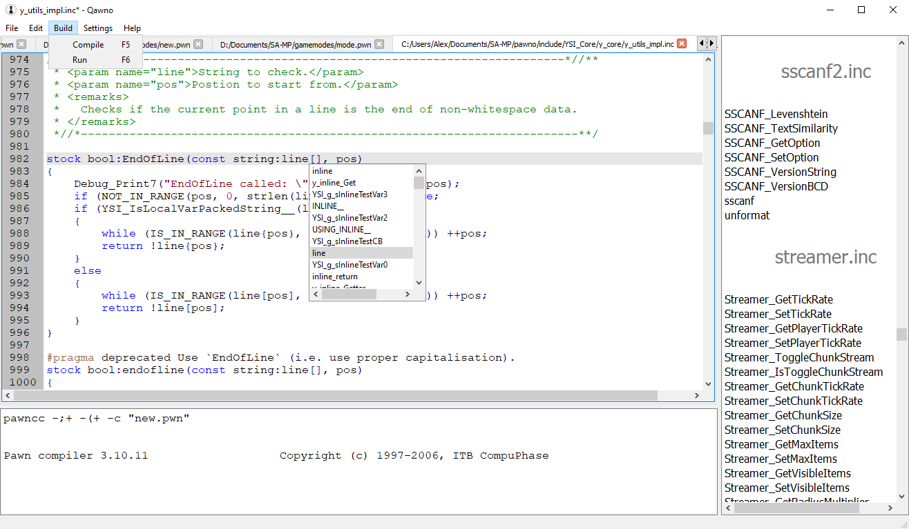

 Features
----------

* **Syntax Highlighting** - Simplify reading code by visually distinguishing different types of text, comments, strings, keywords, etc.
* **Auto Completion** - Speeds up code by trying to guess what function you are trying to write, and suggesting complete symbols to insert in to code.
* **Natives List** - Show known natives (and some other functions) in a side bar for fast reference.  Clicking on these will show their parameters and return types as well.
* **Tabs** - Open multiple files at once while working on large scripts.
* **Pawn Compiler** - Compile your code and view the output directly in a panel at the bottom of the program.
* **open.mp Launch** - Start a server running your code immediately for fast feedback.
* **Colour Picker** - Select hex numbers representing colours visually (`Ctrl+M`).
* **Editing Helpers** - Scroll with `Ctrl+Up`/`Ctrl+Down`.  Duplicate a line with `Ctrl+D`.  Delete a line with `Ctrl+L`.  Comment a line with `Ctrl+K`.  Also block comment a selection with `Ctrl+K`.
* **Find And Replace** - Search for some text, and optionally replace the found location with new text.  Alternatively replace all the instances of that text with the new version.

 Main View
-----------

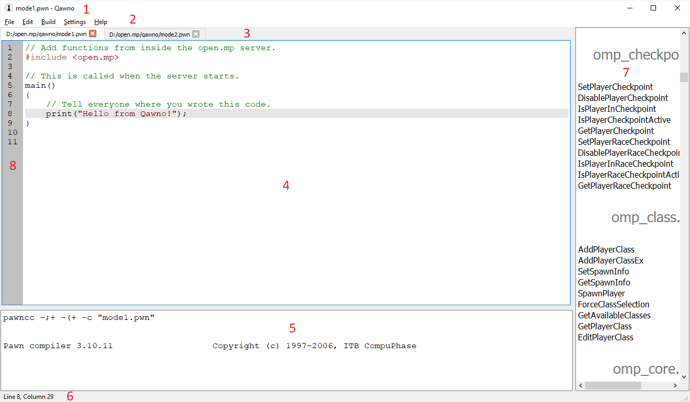

### 1. The Title Bar.

Tells you the name of the file currently being edited, and the name of the program (*Qawno*).  If the current file has been changed and not saved this will include a `*` after the filename:


### 2. The Menu Bar.

Provides visual access to all the editor features and options.

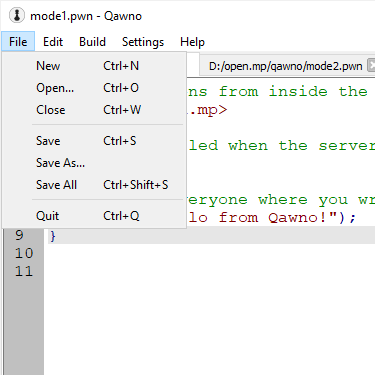

* *New* - Start a new file in a new tab (shown in area ***3***).
* *Open* - Open an existing file in a new tab (or the initial tab if the program was just started).
* *Close* - Close the current file in the current tab.  Will prompt you to save it if the code has been changed.
* *Save* - Save the current file in the current tab.  Will do *Save As* for new files.
* *Save As* - Save the current file in the current tab with a specified name and location.
* *Save All* - Save all the files open in all the tabs.  New files will prompt for a name and location.
* *Quit* - Close Qawno.  Will remember all the currently open tabs for next time.

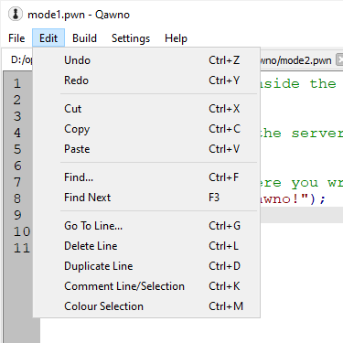

* *Undo* - Revert the last change made, such as typing, pasting, or replacing.
* *Redo* - If you undid an action, perform the action again.
* *Cut* - Put the currently selected code on to the clipboard and delete it from the editing text.
* *Copy* - Put the currently selected code on to the clipboard.
* *Paste* - Insert the latest item from the clipboard (if it is text) in to the current position in code.  If code is selected this will replace the selection.
* *Find...* - Search for some text in the current document.  May optionally replace the found text with new text.
* *Find Next...* - If an item of text has been found this attempts to move on to the next instance of that text in the current file.
* *Go To Line...* - Enter a line number and the cursor will move straight to that line (see area ***8***).  Useful for jumping to compiler error locations.
* *Delete Line* - Will remove the whole line that the cursor is currently on.
* *Duplicate Line* - Will make a copy of the whole line that the cursor is currently on below the current line.
* *Comment Line/Selection* - If the cursor is on a normal line with nothing selected, this will comment out the current line by adding `//` to the start.  If a block of text is selected this will instead comment out that block using `/* */`.  Pressing this option again on the same line or block will reverse the action, so performing it on a line or block already commented out will uncomment the line or block.
* *Colour Selection* - Opens the colour selection dialog (colour picker).  This makes inserting hex colour codes simpler by allowing you to choose them visually, and by pre-defining and saving useful or common ones.  See below for full documentation on this feature.

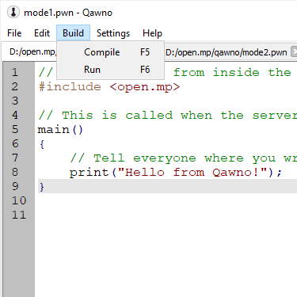

* *Compile* - Use the pawn compiler to convert the current file in to a .AMX.  Will save *all* open files first as the main script may depend on other files being edited at the same time.
* *Run* - Compile the code as with *Compile*, and then attempt to run the open.mp server and lauch the current mode.  If a server is already open this will first kill that instance so that clients/players connected will automatically re-connect.

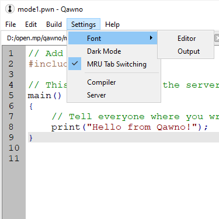

* *Font -> Editor* - Change the font styles and sizes used in the main code editor pane (area ***4***).
* *Font -> Output* - Change the font styles and sizes used in the compiler output pane (area ***5***).
* *Dark Mode* - Make the main background for the editor, compiler, and native selector (areas ***4***, ***5***, and ***7***) black, and the code and other writing bright colours on top of this dark background.  Or reverse the effect.
* *MRU Tab Switching* - You can change which tab (and thus file) is current visible using *Ctrl+Tab* to cycle through the tabs from left to right, or `Ctrl+Shift+Tab` to go from right to left.  This option instead changes that behaviour so that *Ctrl+Tab* instead jumps straight to the tab used previously, making the current tab the previous tab in the process.  Keeping *Ctrl* held down will continue to cycle through in the *Most Recently Used* (*MRU*) order, with *Ctrl+Shift+Tab* still going backwards through this new order.
* *Compiler* - Set the location and launch parameters for the compiler when using *Build -> Compile*.
* *Server* - Set the location and launch parameters for the server when using *Build -> Run*.


* *About* - Display information about who wrote this Pawn editor.
* *About Qt* - Display information about the Qt library, used to create this Pawn editor.

### 3. The Tab Bar

This shows you all the files you currently have open.  Clicking on any of the tabs will bring that file to the fore so you can edit it.  If there are a lot of tabs open (or tabs with long paths) the tab bar will have small arrows for scrolling the list.

### 4. The Editor

This is where you type code to be run later.

### 5. Compiler Output

This is where the compiler displays its messages after being invoked with *Run -> Compile*.

### 6. The Status Bar

By default this shows the current line and column of the cursor:


If some text is selected it will also display how much text is selected:


If a native is selected from the native list (area ***7***) the status bar will display the full prototype (design) for the selected native:


### 7. The `native`s List

When Qawno starts it looks for all `.inc` files in `qawno/include` (but not subdirectories) and opens them to look for `native` functions.  The results of this search are shown in this area, and are also added to auto complete's list of suggestions.  This allows for very rapid access to known server/component/plugin function while writing code - both through predictions and through the list in this area.  Clicking on a native will display the full prototype for the function in the status bar (see ***6. The Status Bar***), the prototype being the return tag, the name, and all the parameters.  While this only lists `native` functions there are built-in tricks to manipulate the list.

Given the following include (`example.inc`):

```pawn
native Example1Impl(value);

stock Example1(value)
{
	return value > 0 ? Example1Impl(value) : 0;
}

native Example2(value);
```

The list for this file looks like:


We would like to:

1. *Not* show the native `Example1Impl` in the list - it is an internal function that should be hidden from users.
2. *Show* `Example1` in the list, despite it not being a native.

The solution to both of these aims are block comments.  The native list doesn't fully parse the file, it just looks for lines that start with `native` (ignoring leading spaces), so we can use this fact to write code that is different for the editor and the compiler:

```pawn
/**/ native Example1Impl(value);

/*
native Example1(value);
*/
stock Example1(value)
{
	return value > 0 ? Example1Impl(value) : 0;
}

native Example2(value);
```

`Example2` hasn't changed, it is still displayed the same.  `Example1Impl` is now no longer on a line that starts with `native` so it isn't displayed.  The compiler still sees it because the `/**/` is skipped, but Qawno doesn't.  And we've added a new `native` declaration for `Example1` that Qawno does see (because the line starts with `native`) but the compiler doesn't (because it is within a `/**/` block comment).  This list becomes:


We have one final requirement:

3. *Organise* the natives in our list aesthetically.

There are only two, but for larger includes this allows for neat grouping of natives.  Bear in mind that the list order in Qawno is always exactly the order from the `.inc` file so this trick can work.  Just like in markdown we can add *native headers* - natives that start with `#`.  These are not valid pawn syntax so must also be commented out, but will be interpreted by Qawno in a special way (and will not be suggested by auto-completion):

```pawn
/**/ native Example1Impl(value);

/*
native #The 1st example();
*/

/*
native Example1(value);
*/
stock Example1(value)
{
	return value > 0 ? Example1Impl(value) : 0;
}

/*
native #The 2nd example();
*/

native Example2(value);
```

In Qawno gives:


A real-world include showing some of these tricks can be seen in [the sscanf plugin](https://github.com/Y-Less/sscanf/blob/master/sscanf2.inc).  The heading were inspired by an earlier trick used by YSI for organising natives in Pawno, but without `#` so they could still be used.

### 8. Line Numbers

This shows the numbers for each line, i.e. how far down in the file they are.  Compiler warnings and errors use these line numbers to direct you to the problems, and you can jump straight to them by value with `Go To Line...`.

 Opening Files
---------------

You can open multiple files at once by selecting them:


Dragging them on to Qawno:


And dropping them there:


 Colour Picker
---------------

Going to *Edit -> Colour Selection* or pressing *Ctrl+M* will bring up the colour selection dialog, shown below:


The left half of the dialog is pre-defined colours.  `Pick Screen Colours` brings up a crosshair with which you can click anywhere on your screen to extract the colour at that point.  `Add to Custom Colours` saves the currently selected colour from the right half of the dialog to the currently selected `Custom colours` slot (make sure you select the slot first to avoid overwriting existing ones).  These saved custom colours will survive Qawno being restarted so you can use them throughout your project.  This half also includes the pre-defined `Basic colours`, detailed later:

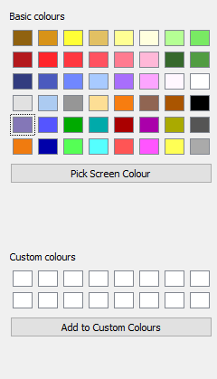

The right half of the screen is the main colour selection area.  The two top boxes can be clicked and dragged to to adjust the current colour.  The `Hue`, `Sat` (*saturation*), and *Val* (*value*) (collectively `HSV`); or `Red`, `Green`, and `Blue` (collectively `RGB`); boxes can be used to make fine adjustments to the individual colour componenets.  The `Alpha channel` input is used by both *HSV* and *RGB* and determines the transparency of the colour.  `0` is invisible (totally transparent), `255` is fully opaque, the default is `170` (`0xAA` in hex).  The `HTML` input can be used to preview an existing colour already in *RGB* hex format, and must include the `#`.  The final panel is a larger preview of the currently selected colour, ignoring transparency:

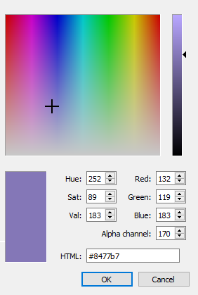

Clicking on `OK` will insert your chosen colour in to your code at the current cursor position.  If the letter immediately before the cursor is an `x` the colour will be inserted as *RGBA*:

```pawn
#define MY_COLOUR 0x// Press Ctrl+M here.

#define MY_COLOUR 0xFF0000AA // After selecting a colour.
```

Anywhere else will give the colour in *RGB* format:

```pawn
#define MY_COLOUR "{}" // Press Ctrl+M in the braces.

#define MY_COLOUR "{FF0000}" // After selecting a colour.
```

Clicking `Cancel` will not insert anything.

The pre-defined `Basic colours` are forty eight common colours from San Andreas, SA:MP, and open.mp, in three groups.  Note that the dialog itself is limited to 48, hence these specific choices and why obvious options like player and vehicle colours were ommitted:

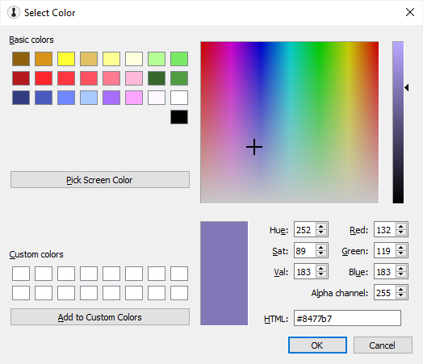

These are the selectable game text colours.  From left to right:

First row:

* `(default)` (game texts default colour, and the currently playing radio station).
* `~h~` (default colour, but slightly lighter).
* `~h~~h~` (default colour, even lighter still).
* `~y~`
* `~y~~h~`
* `~y~~h~~h~` (the same as `~g~~h~~h~~h~~h~`).
* `~g~~h~~h~~h~`
* `~g~~h~~h~`

Second row:

* `~r~` (also the color of negative money).
* `~r~~h~`
* `~r~~h~~h~`
* `~r~~h~~h~~h~`
* `~r~~h~~h~~h~~h~`
* `~r~~h~~h~~h~~h~~h~` (the lightest any colour can go without becoming white).
* `~g~~h~`
* `~g~` (also the colour of positive money).

Third row:

* `~b~`
* `~b~~h~`
* `~b~~h~~h~`
* `~b~~h~~h~~h~`
* `~p~`
* `~p~~h~`
* `~p~~h~~h~`
* `~w~` (also any other colour with an extra `~h~`).

Fourth row:

* `~l~`

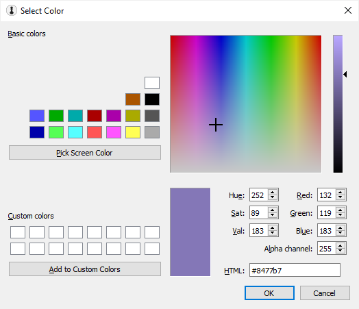

These are the 17 CGA colours, just a simple set of common primary and secondary colours.  The white and black are the same as the game text colours, and the brown on top is the later "tweaked brown".

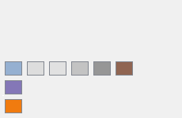

The remaining few colours are extras with special meanings.  From left to right again:

First row:

* Game Text styles 2 and 5 default colour, plus the clock colour.
* Game Text style 6 default colour.
* Radio station changing text colour
* Y_Less' avatar's yellow.
* Y_Less' avatar's orange.
* Main brown from the SA:MP client icon.

Second row:

* open.mp branding purple.

Third row:

* SA:MP branding orange.

